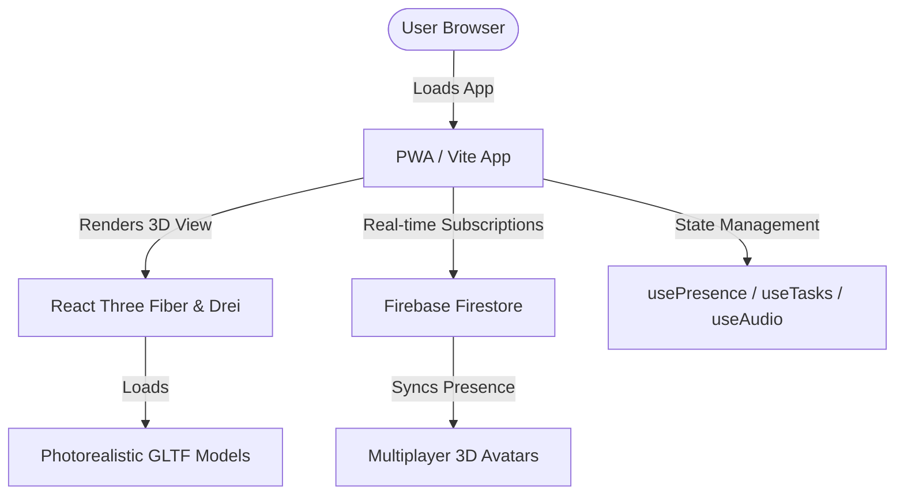

# 🏡 Digital Home 

> A personal productivity PWA built around the metaphor of a house—where each room represents a different life context. Study, work, relax, and collaborate, all in one place that feels like yours. 
> 
> *Built for personal use first. Designed to feel like home.*

[](https://digital-home-cc21b.web.app)
[](https://react.dev)
[](https://threejs.org)
[](https://firebase.google.com)

---

## ✨ What It Is

Digital Home is an immersive web application where your life is organized into interactive rooms:

*   **📚 Study Room** — Focus mode, exam countdowns, radio, notes, and lofi loops.
*   **💼 Work Room** — Tasks, projects, quick links, and productivity focus tools.
*   **🛋️ My Room** — Personal to-dos, journal, avatar creator, and your private space.
*   **👥 Shared Rooms** — Collaborate with household members in real-time.

Each room has interactive furniture you click to open panels—a desk opens your tasks, a bookshelf opens your notes, and a radio plays internet stations. The UI is a beautiful 3D space built with React Three Fiber, designed to feel completely immersive without being overwhelming.

---

## 🎨 Design System & V2 Aesthetics

Digital Home is heavily inspired by Apple's signature hardware and software aesthetic guidelines, blended with a lofi room layout:

*   **Frosted Glassmorphism Sheets**: UI modals use `backdrop-filter: blur(20px) saturate(140%)` overlays with soft surface colors (`rgba(36,36,36,0.78)` for dark theme, `rgba(255,255,255,0.78)` for light theme).
*   **iOS Standard Animation Curves**: Fluid sheet slide-ups and state transitions utilize native Apple curves (`cubic-bezier(0.32, 0.72, 0, 1)`) with a native-feeling `0.4s` timing.
*   **Hairline Gold Borders**: Whisper-thin highlights (`rgba(196, 168, 130, 0.14)` for dark mode, `rgba(139, 111, 71, 0.14)` for light mode) outline all active components, cards, and modal grab handles to catch ambient shadows.
*   **Monoline Vector Icons**: Emojis have been migrated to precise, cohesive `lucide-react` vector elements set to a monoline stroke weight of `strokeWidth={1.5}`.
*   **Quiet Microcopy**: Professional, calm, second-person action copy with standard sentence casing throughout headers, placeholders, and loading ellipsis (`…`).

---

## ⚡ Key Design Decisions

*   **Slide Sheet Modals (Non-Disruptive Flow)**: Clicking on furniture opens a smooth glassmorphic bottom sheet panel instead of navigating away to a new page, keeping you fully in the room.
*   **Camera Lerp & Zoom Target**: The 3D camera smoothly lerps directly toward clicked furniture to look at it up-close, and gracefully lerps back to the room view when the panel is dismissed.
*   **Three.js Module Deduplication**: Enabled built-in Vite `dedupe` systems inside `vite.config.js` to solve global cache conflicts, resolving any rendering conflicts between React Three Fiber and Spline.
*   **Memory-Optimized Mesh Cloning**: Custom GLTF models utilize Drei's `<Clone>` wrapper to guarantee separate heap-allocation, eliminating race conditions on shared object graphs.
*   **Adaptive Viewport FOV**: Fully optimized for mobile screens. The camera dynamically adjusts its Field of View (FOV) to `75` on mobile screens for a wider isometric view, and `50` on desktop monitors for perfect room framing.
*   **Avatar Idle Bobbing**: An animated avatar sits at the desk in every room with a gentle, breathing idle bob animation.

---

## 🔌 Free API Integrations

No private API keys are needed—all integrated systems are completely free and open out of the box:

*   **Radio Browser**: Drives the internet radio tuner in Study/Work rooms.
*   **Open-Meteo**: Syncs your local weather to dynamically affect room lighting and window views.
*   **Quotable**: Powers daily motivational quotes inside the home panel.

---

## 📂 Project Structure

```bash
├── public/
│   └── models/               # GLTF 3D models (classroom & vintage room)
├── src/
│   ├── pages/                # Main Room Pages (StudyRoom, WorkRoom, MyRoom, Home, Door)
│   ├── components/
│   │   ├── room3d/           # All 3D Scene graphics, shaders, and animations
│   │   │   ├── Furniture3D   # Low-poly interactive fallback furniture primitives
│   │   │   ├── Room3D        # Shared WebGL Canvas, lighting rigs, and camera systems
│   │   │   └── Study/My/Work # Context-specific GLTF room scenes
│   │   └── room/
│   │       ├── RoomSheet     # Premium sliding frosted bottom sheet
│   │       └── panels/       # Content panels (Tasks, Notes, Pomodoro, settings)
│   ├── hooks/                # Real-time Firebase Firestore data subscriptions
│   └── styles/
│       └── index.css         # Apple-inspired tailwind styles and CSS variables
```

---

## 🛠️ The Tech Stack

*   **Frontend Library**: React 19 (React-DOM, TypeScript compatible)
*   **3D Render Engine**: Three.js (r184), React Three Fiber (R3F)
*   **3D Declarative Helpers**: `@react-three/drei` (Clone nodes, OrbitControls, Environment presets, ContactShadows)
*   **Backend & DB**: Firebase v12 (Firestore Realtime DB, Auth, Hosting, Storage)
*   **Styling & Motion**: Tailwind CSS v4, Framer Motion
*   **Bundler**: Vite 8, Rolldown
*   **PWA Cache**: Workbox Progressive Web App configuration (`sw.js`)

---

## 💻 Quick Start & Installation

### Prerequisites
- Node.js (v18+)
- Firebase CLI (`npm install -g firebase-tools`)

### 1. Clone the repository
```bash
git clone https://github.com/Hardikkundalwal/digital-home.git
cd digital-home
```

### 2. Install dependencies
```bash
npm install
```

### 3. Configure credentials
Copy the public environment template and fill in your private Firebase API keys:
```bash
cp .env.example .env
```
Add your credentials to the newly created `.env` file (this file is pre-configured in `.gitignore` and will never be committed to GitHub).

### 4. Run local development server
```bash
npm run dev
```

### 5. Build for production & Deploy
```bash
npm run deploy
# (Builds the app and deploys to Firebase Hosting in one command)
```

---

## 🗺️ Roadmap

*   `[x]` **V0** — Single page task list with Firestore sync
*   `[x]` **3D Rooms** with clickable furniture
*   `[x]` **Firebase Auth** (login / stay logged in)
*   `[x]` **Study Room** with radio panel
*   `[x]` **Exam countdown** widget
*   `[x]` **Weather-reactive** room windows
*   `[x]` **Shared rooms** with live avatar presence
*   `[x]` **Mobile camera FOV** improvements
*   `[x]` **Replace primitive furniture** with GLTF models
*   `[ ]` **Remote capture** ("add this to my list" from anywhere)
*   `[ ]` **Local AI assistant** via Ollama (planned)

---

## 🧩 Architecture Flow



---

## 📄 License

This project is licensed under the MIT License - see the [LICENSE](LICENSE) file for details.
